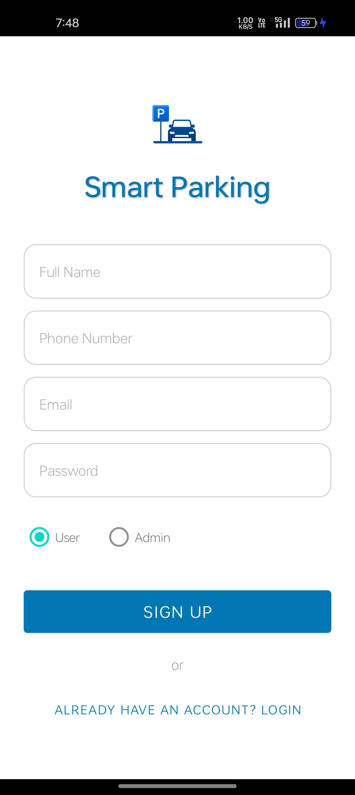
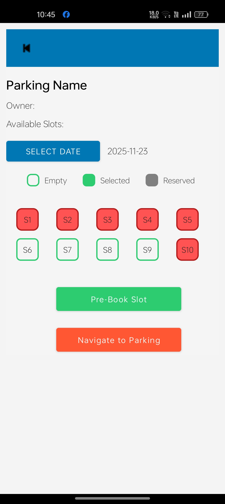
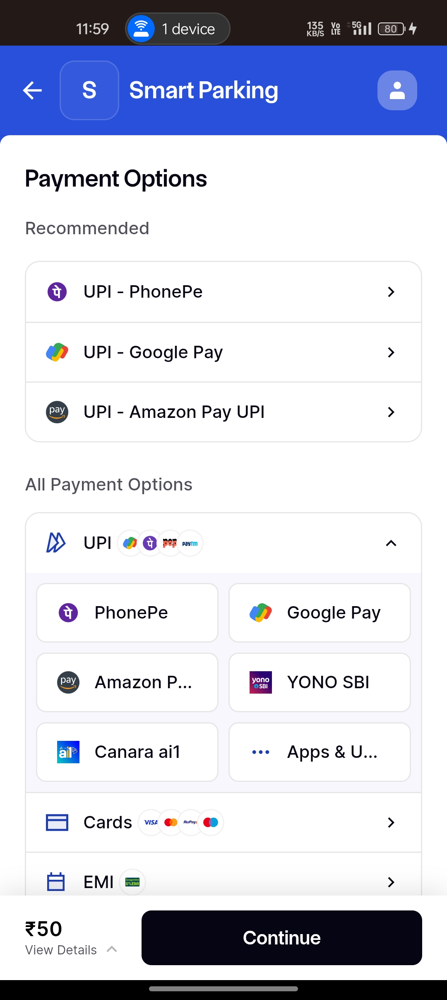
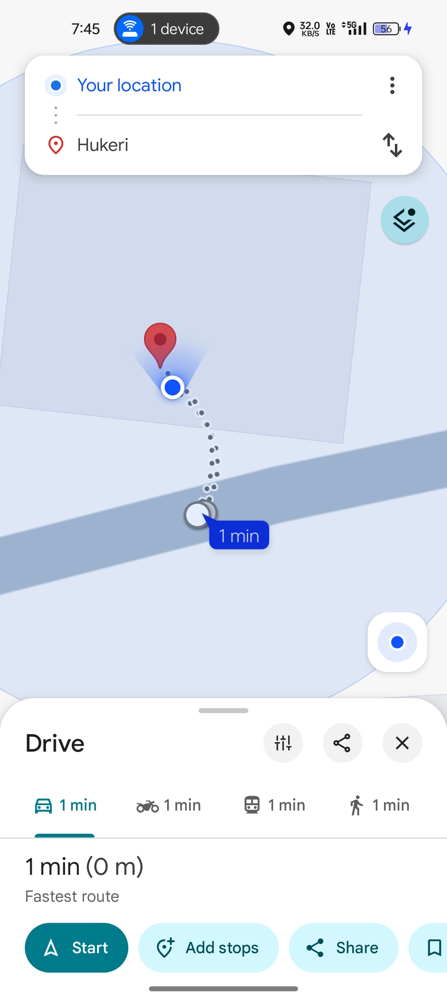
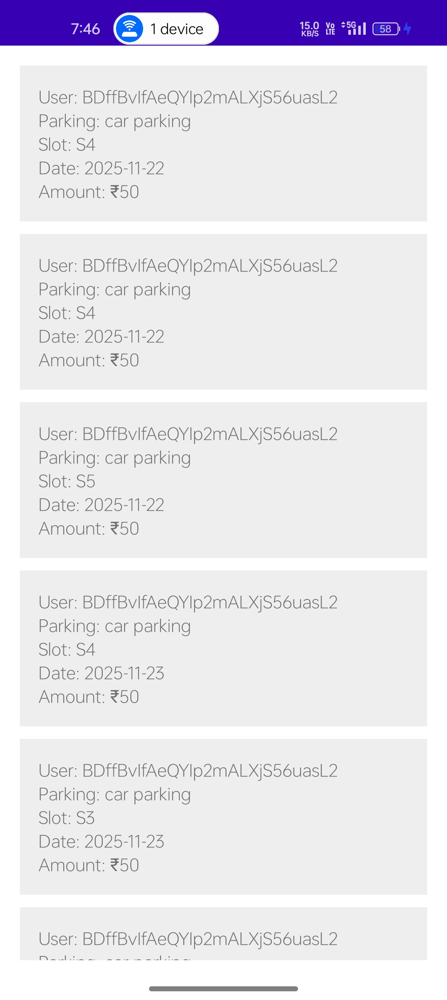

# Smart Parking System 🚗

## Project Description
This project detects empty parking slots using image processing.
If an obstacle is detected inside the parking slot coordinates, it is marked as occupied otherwise it is marked as empty or if user reserved for
perticular day it shows as reserved and not able to book that slot to anyone again.

## Technologies Used
- YOLO
- Kotlin
- XML
- RazorPay
- OCR

## Features
- Detect empty parking slots
- Show the slot availability status (Empty, Reserved, Occupied)
- Navigation support from User location to Parking area
- Online Payment facility

## Project Screenshots

### SignUp page

### Slot availability status

### Payment Mode

### Navigation

###Booking History

